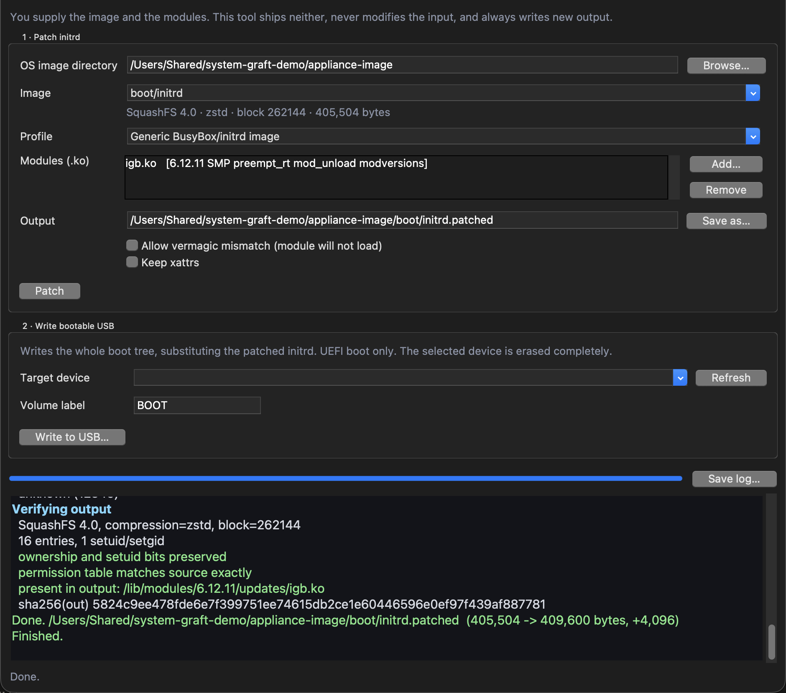
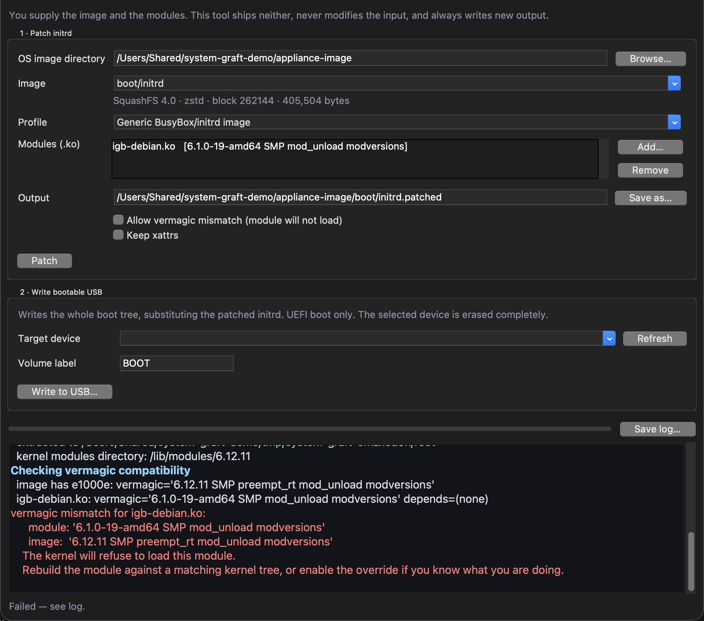

# System Graft user guide

Injecting kernel modules into a SquashFS initrd, and writing a bootable UEFI USB stick.

The [README](../README.md) explains the vermagic constraint, the bootability model and the
safety model in detail. This is the workflow, and what to be careful with.

---

## Read this before running anything
### This tool erases disks

The USB writer **repartitions and erases whole block devices.** Point it at the wrong device and
it destroys a disk. There is no undo and no recovery.

Several guards exist and they are good ones — external devices only, internal disks rejected even
when named explicitly, the device re-read immediately before writing, anything mounted at a
system path refused, and the GUI making you **type the device node** after showing model, size,
bus and mount points. **Do not look for ways around them.**

### What is actually proven

Three separate claims that are easy to collapse into one:

| | Evidence |
|---|---|
| **The patch path** — injecting modules into the initrd | **16 tests, run on Ubuntu and macOS in CI**, and exercised against a **real appliance firmware image**. Genuinely well-evidenced. |
| **The USB writer** | Only ever run against an **attached disk image — never a physical stick.** |
| **The result booting** | **No image produced by this tool has ever been booted on real hardware.** |
| **The Linux write path** | **Implemented and completely untested.** |

So: **the transformation is well tested, the delivery mechanism largely isn't, and the end result
has never been proven to boot.** Plan for the possibility that the stick doesn't boot, and keep
the original image.

macOS is the tested platform for writing. Windows isn't supported.

---

## The workflow

*"You supply the image and the modules. This tool ships neither, never modifies the input, and
always writes new output" — the app's own first line, and the shape of the whole thing.*

1. **Get the image and the modules.** The tool reads an image you provide and modules you
   provide, and writes a new initrd. It doesn't fetch anything.
2. **Patch** — inject the modules into the initrd.
3. **Write** — put the boot tree, with the patched initrd substituted in, onto a USB stick.

There's a GUI and a CLI; see the README for invocation.

---

## The vermagic wall, and why you shouldn't climb it

*The refusal states both vermagic strings and what to do about it. **Allow vermagic mismatch**
above the Patch button is the override, and its own label tells you the outcome: "module will not
load".*

A module only loads into a kernel whose **vermagic matches exactly** — kernel version, SMP,
preemption model, `mod_unload`, `modversions`.

Get it wrong and the kernel **refuses the module silently, at boot, on a machine you may not have
a console on.** That's the failure this tool exists to prevent, so it reads the vermagic of every
`.ko` already in the image and every `.ko` you're adding, and **blocks on mismatch by default**,
printing both strings side by side.

There is an override. It is off by default and it "exists for people who know why they want it".
**It is not a way past an inconvenient error** — the module still won't load; you'll just find out
at boot instead of now.

> **Matching the vermagic string is necessary but not sufficient.** If `CONFIG_MODVERSIONS`
> appears in it, the **symbol CRCs must match too**. Build against the same kernel **source and
> config** as the image's kernel — not merely the same version number.

If the driver you need can't be built as a module against that kernel, **this tool can't help
you.** It doesn't touch the kernel, only the initrd.

---

## Choosing a profile
A profile tells the tool where the initrd lives, which init script to hook, and **how a module
load is written in that image's idiom**.

| Profile | For |
|---|---|
| `generic` | Generic BusyBox/initrd image |
| `sgs` | Waves SGS (SoundGrid Server) — `boot/initrd`, `etc/init.d/system` |

The hook goes in **immediately before the image's own module loading**, or failing that before it
brings up networking.

The `sgs` profile writes loads wrapped in `Run "…"` because SGS init scripts do — matching the
image's own conventions rather than looking foreign in it.

**Re-patching an already-patched image replaces the hook rather than stacking another one.**

---

## Things that are silently dropped or refused
| | Behaviour |
|---|---|
| **cpio/gzip initramfs** | **Detected and rejected with a clear message.** SquashFS only — it won't corrupt one by trying. |
| **xattrs** | **Dropped by default.** On macOS the extract picks up host `com.apple.*` attributes, and baking those into a Linux image is at best noise. |
| **File capabilities** | Live in xattrs, so **dropped with them.** If your image relies on file caps rather than setuid, you need `--keep-xattrs` — **and to run on Linux**, since macOS is what introduces the junk. |
| **SELinux labels** | Same. |
| **The kernel** | Never touched. |
| **Everything outside the initrd** | Never touched — no vendor container formats opened, no checksums recomputed, no compatibility lists edited. |

---

## Writing the USB stick
**Only external devices are ever offered.** Internal disks are filtered out before you can see
them and rejected again if you name one explicitly.

**Attached disk images are excluded** unless you explicitly allow them — that switch exists so
the write path can be tested against a throwaway image instead of a real stick, and it is
deliberately **not offered in the GUI**.

Before the destructive step the device is **re-read**, so a stale selection can't be acted on. If
the stick was removed or changed, the write aborts.

**Every written file is verified by sha256** against its source before the volume is ejected.

### Bootability is UEFI-only, and only warned about

The volume boots through the removable-media fallback path `\EFI\BOOT\BOOTX64.EFI` — no NVRAM
entry, no boot sector.

**If your tree doesn't contain that file, the tool warns you and still writes.** A warning you
click past produces a stick that isn't bootable. **Read the warning.**

**Legacy BIOS is not supported** — that needs a boot sector this tool doesn't install. You can do
it afterwards yourself.

The partition type is set to EFI System **if `sgdisk` is available and can elevate**; otherwise
it's left as Microsoft Basic Data, which virtually all firmware accepts on removable media. So
the partition type quietly depends on whether elevation succeeded.

---

## Troubleshooting
| Symptom | Cause |
|---|---|
| **"vermagic mismatch" and it refuses** | Working as intended. Rebuild the module against a matching kernel tree ([The vermagic wall, and why you shouldn't climb it](#the-vermagic-wall-and-why-you-shouldnt-climb-it)). |
| **Overrode the mismatch, module still doesn't load at boot** | Expected. The override doesn't make the kernel accept it — and with `CONFIG_MODVERSIONS`, CRCs must match too ([The vermagic wall, and why you shouldn't climb it](#the-vermagic-wall-and-why-you-shouldnt-climb-it)). |
| **Image rejected as not SquashFS** | It's a cpio/gzip initramfs. Not supported, and refusing beats corrupting it ([Things that are silently dropped or refused](#things-that-are-silently-dropped-or-refused)). |
| **File capabilities lost in the patched image** | xattrs are dropped by default; use `--keep-xattrs`, on Linux ([Things that are silently dropped or refused](#things-that-are-silently-dropped-or-refused)). |
| **Stick written but won't boot** | No `\EFI\BOOT\BOOTX64.EFI` in the tree — the tool warned ([Writing the USB stick](#writing-the-usb-stick)). Or the firmware is legacy-BIOS only ([Writing the USB stick](#writing-the-usb-stick)). Or: **no image from this tool has ever been booted on real hardware** ([Read this before running anything](#read-this-before-running-anything)). |
| **Firmware doesn't see the partition** | `sgdisk` couldn't elevate, so the type stayed Microsoft Basic Data ([Writing the USB stick](#writing-the-usb-stick)). |
| **My USB stick isn't listed** | Only devices the OS reports as **external** are shown ([Writing the USB stick](#writing-the-usb-stick)). |
| **A disk image isn't listed** | Virtual devices need the explicit allow flag, and it isn't in the GUI ([Writing the USB stick](#writing-the-usb-stick)). |
| **The write aborted just before starting** | The device was re-read and had changed or gone ([Writing the USB stick](#writing-the-usb-stick)). |
| **On Linux and it behaved oddly** | The Linux write path is **implemented and completely untested** ([Read this before running anything](#read-this-before-running-anything)). |

---

## See also

- [API.md](API.md) — both CLIs, the Python API, and the profile system
- [DEVELOPING.md](DEVELOPING.md) — the rules for working on this safely
- [README](../README.md) — vermagic, bootability, safety model, scope
